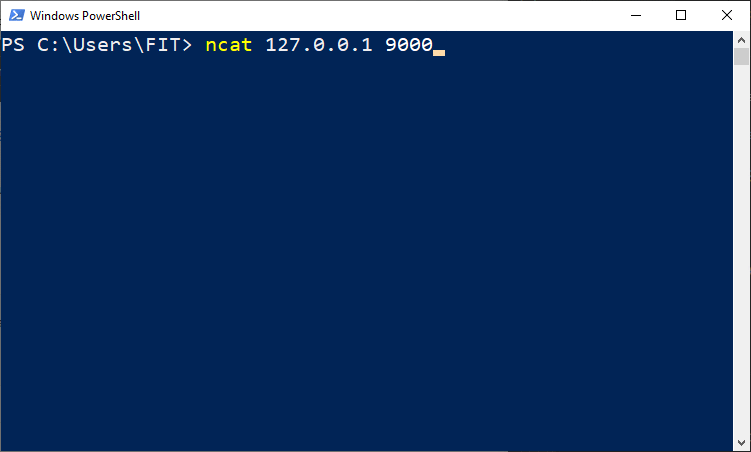

# Memcached-Server

### What is it?

A Memcached server...

> allows applications that need to access a lot of data from an external database to cache some of the data in memory, which can be accessed much more quickly by the application than having to travel out to the database to fetch something important.

This implementation of the memcached server, it's a TCP based server that listens for connections on port 9000, allowing commands from any Memcached client.

### Installation

Memcached-Server requires: [Node.js](https://nodejs.org/) to run.

Clone the repo, install the dependencies and start the server

```sh
$ git clone https://github.com/PatricioZarauz/Memcached-Server.git
$ cd Memcached-Server
$ npm install -d
$ node app
```

Now we have the server running, to terminate it, just close the console or press ctrl + c on the keyboard.

For the client side, please install [NCat](https://nmap.org/ncat/) to connect to the Memcached server without any issues.

To start the client just execute the following command...

```sh
$ ncat 127.0.0.1 9000
```

As this is a local server, the ip address will be 127.0.0.1

### Demo client



Please note, that in order to terminate a client connection, just close the console or press ctrl + c on the keyboard.

### Commands accepted by the server

##### Retrieval commands:

-   get

```sh
$ get <key1> <key2> <key3> ... <keyn>
```

-   gets

```sh
$ gets <key1> <key2> <key3> ... <keyn>
```

Each `<key>` is a string separated by white space

##### Storage commands:

-   set

```sh
$ set <key> <flags> <exptime> <bytes> [noreply]
$ <data block>
```

-   add

```sh
$ add <key> <flags> <exptime> <bytes> [noreply]
$ <data block>
```

-   replace

```sh
$ replace <key> <flags> <exptime> <bytes> [noreply]
$ <data block>
```

-   append

```sh
$ append <key> <flags> <exptime> <bytes> [noreply]
$ <data block>
```

-   prepend

```sh
$ prepend <key> <flags> <exptime> <bytes> [noreply]
$ <data block>
```

-   cas

It should be used after the gets command inorder to know the cas unique of the item.

```sh
$ cas <key> <flags> <exptime> <bytes> <cas unique> [noreply]
$ <data block>
```

`<key>` is a string separated by white space.<br/>
`<flags>` is an arbitrary 16-bit unsigned integer.<br/>
`<exptime>` is the expiration time of the item, measured in seconds.<br/>
`<bytes>` is the number of bytes in the data block to follow.<br/>
`<cas unique>` is a unique 64-bit value of an existing entry. In the server, the cas unique is composed of the ip address and port number of the client.<br/>
`<data block>` is a string, with an 8-bit data of length<br/>

Please note that in order to not display a replay message [noreply] should be replaced by writing: "noreply" without quotations.

### Test Cases

In order to run the test cases implemented, the following command needs to be executed

```sh
$ npm test
```
